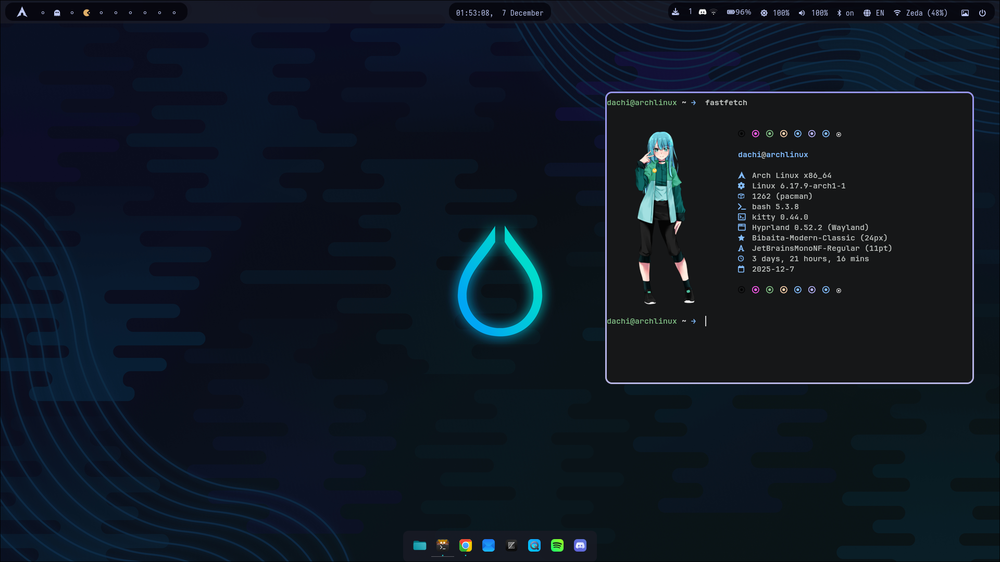

## My Hyprland dotfiles

### Dependencies

* hyprland
* kitty
* dunst
* nwg-dock-hyprland
* rofi
* swaylock
* wlogout
* waybar
* wl-paste
* swww
* wlsunset
* hyprshot

### Optional dependencies

* cava
* fastfetch
* nvim
* nm-applet

### Fonts

* Iosevka Font 
* JetBrains Nerd Font Mono ExtraBold
* FontAwesome

### Related

* [Bibata-Modern-Classic mouse cursor](https://github.com/ful1e5/Bibata_Cursor)
* [Adw-gtk3-dark GTK theme](https://github.com/lassekongo83/adw-gtk3)
* [Fastfetch config](https://github.com/souravas/fastfetch)
* [Updates indicator](https://github.com/savely-krasovsky/waybar-updates)
